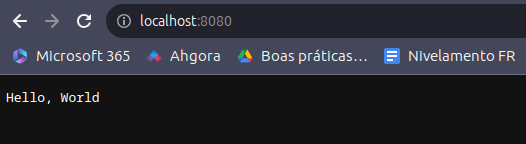
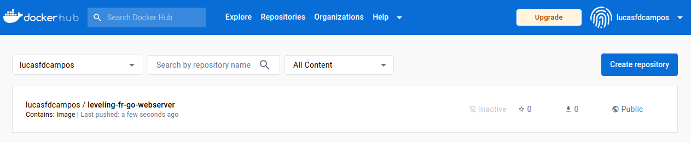

Fluxo: [notes](https://www.notion.so/Nivelamento-e90fad7d5de04f9bb2a91568932c9e01?pvs=4#b1a0a1bd3ce84a0da24c20753a867540)

Docker build

```bash
docker build -t lucasfdcampos/leveling-fr-go-webserver .
```

Verificar tamanho da imagem

```bash
docker images lucasfdcampos/leveling-fr-go-webserver
```

```bash
REPOSITORY                               TAG       IMAGE ID       CREATED          SIZE
lucasfdcampos/leveling-fr-go-webserver   latest    7ab78ef31e4c   30 seconds ago   885MB
```

Testando

```bash
docker run -p 8080:8080 lucasfdcampos/leveling-fr-go-webserver:latest
```

```bash
curl localhost:8080
```

Saída do log:

```bash
➜  docker run -p 8080:8080 lucasfdcampos/leveling-fr-go-webserver:latest
Hello, World
```

Saída no Browser


Push da imagem

Login

```bash
docker login
```

```bash
docker push lucasfdcampos/leveling-fr-go-webserver:latest
```

Imagem no Docker hub
